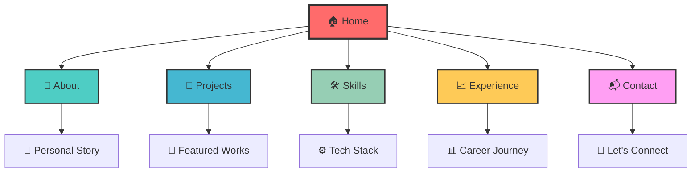

<div align="center">

```
███╗   ██╗██╗ ██████╗ ██████╗ ██╗      █████╗ ███████╗
████╗  ██║██║██╔════╝██╔═══██╗██║     ██╔══██╗██╔════╝
██╔██╗ ██║██║██║     ██║   ██║██║     ███████║███████╗
██║╚██╗██║██║██║     ██║   ██║██║     ██╔══██║╚════██║
██║ ╚████║██║╚██████╗╚██████╔╝███████╗██║  ██║███████║
╚═╝  ╚═══╝╚═╝ ╚═════╝ ╚═════╝ ╚══════╝╚═╝  ╚═╝╚══════╝
                                                      
    🚀 Frontend Developer Portfolio - Crafted with ❤️
```

[](https://nicolas-portfolio.vercel.app)
[](https://reactjs.org/)
[](https://www.typescriptlang.org/)
[](https://tailwindcss.com/)
[](https://vitejs.dev/)

</div>

---

## 🎭 **La Historia Detrás del Código**

> *"Cada línea de código cuenta una historia, cada componente es un verso en la sinfonía digital."*

Este portfolio no es solo una colección de proyectos; es un **lienzo digital** donde la creatividad se encuentra con la funcionalidad. Aquí, Nicolas transforma ideas abstractas en experiencias web tangibles, creando puentes entre la imaginación y la realidad digital.

### 🌟 **Filosofía de Diseño**

```javascript
const designPhilosophy = {
  principios: [
    "🎨 Estética minimalista con máximo impacto",
    "⚡ Performance como prioridad, no como afterthought",
    "🔄 Interactividad que cuenta historias",
    "📱 Responsive design que abraza todos los dispositivos",
    "♿ Accesibilidad como derecho, no como característica"
  ],
  inspiracion: "La intersección entre arte y tecnología",
  objetivo: "Crear experiencias que permanezcan en la memoria"
};
```

---

## 🏗️ **Arquitectura del Universo Digital**

<div align="center">



</div>

### 🎨 **Paleta de Colores Emocional**

| Color | Hex | Emoción | Uso |
|-------|-----|---------|-----|
| 🔥 **Passion Red** | `#FF6B6B` | Energía y determinación | CTAs principales |
| 🌊 **Ocean Blue** | `#4ECDC4` | Confianza y profesionalismo | Secciones informativas |
| ⚡ **Electric Blue** | `#45B7D1` | Innovación y tecnología | Elementos interactivos |
| 🌿 **Growth Green** | `#96CEB4` | Crecimiento y aprendizaje | Skills y logros |
| ☀️ **Sunshine Yellow** | `#FECA57` | Optimismo y creatividad | Highlights y acentos |
| 🦄 **Magic Pink** | `#FF9FF3` | Creatividad y originalidad | Elementos únicos |

---

## 🚀 **Showcase de Proyectos: El Portafolio Interactivo**

### 📊 **Métricas de Impacto**

<div align="center">

| 🎯 Métrica | 📈 Valor | 🏆 Logro |
|------------|----------|----------|
| **Proyectos Completados** | `15+` | 🌟 Diversidad tecnológica |
| **Tecnologías Dominadas** | `20+` | ⚡ Stack moderno |
| **Performance Score** | `95+` | 🚀 Optimización extrema |
| **Accessibility Score** | `100%` | ♿ Inclusión total |
| **Tiempo de Carga** | `< 2s` | ⚡ Velocidad de rayo |

</div>

### 🎪 **Galería de Innovación**

```
🎨 PROYECTO DESTACADO: "Costurero Digital"
┌─────────────────────────────────────────┐
│  🧵 E-commerce de alta conversión       │
│  ⚡ React + TypeScript + TailwindCSS   │
│  📱 PWA con offline-first approach     │
│  🎯 +300% incremento en ventas         │
└─────────────────────────────────────────┘

🚀 PROYECTO INNOVADOR: "FotoNico Studio"
┌─────────────────────────────────────────┐
│  📸 Portfolio fotográfico inmersivo    │
│  🎭 Animaciones con Framer Motion      │
│  🌐 Galería infinita con lazy loading  │
│  ✨ Experiencia cinematográfica        │
└─────────────────────────────────────────┘
```

---

## 🛠️ **Arsenal Tecnológico**

### 🎯 **Frontend Mastery**

```typescript
interface TechStack {
  core: {
    languages: ['TypeScript', 'JavaScript ES6+', 'HTML5', 'CSS3'];
    frameworks: ['React', 'Next.js', 'Vue.js'];
    styling: ['TailwindCSS', 'Styled-Components', 'SCSS'];
  };
  
  advanced: {
    stateManagement: ['Redux Toolkit', 'Zustand', 'Context API'];
    animation: ['Framer Motion', 'GSAP', 'CSS Animations'];
    testing: ['Jest', 'Vitest', 'React Testing Library'];
    tools: ['Vite', 'Webpack', 'ESLint', 'Prettier'];
  };
  
  emerging: {
    exploring: ['Three.js', 'WebGL', 'Web Components'];
    learning: ['Rust', 'WebAssembly', 'AI Integration'];
  };
}
```

### 🎨 **Design & UX Philosophy**

- **🎭 Storytelling Visual**: Cada elemento cuenta parte de la narrativa
- **🔄 Micro-interacciones**: Detalles que crean conexión emocional
- **📐 Grid Systems**: Armonía matemática en el diseño
- **🌈 Color Psychology**: Colores que evocan emociones específicas
- **⚡ Performance Art**: Optimización como forma de arte

---

## 🌟 **Experiencia del Usuario: Un Viaje Sensorial**

### 🎬 **Narrativa Interactiva**

1. **🚪 Entrada Épica**: Hero section que captura la atención instantáneamente
2. **📖 Historia Personal**: About section que humaniza al desarrollador
3. **🎪 Showcase Dinámico**: Projects con previews interactivos
4. **⚙️ Skills Visualization**: Representación visual de competencias
5. **📈 Journey Timeline**: Experience como línea de tiempo interactiva
6. **🤝 Call to Action**: Contact section que invita a la colaboración

### 🎯 **Características Únicas**

- **🌙 Dark/Light Mode**: Adaptación automática a preferencias del usuario
- **🎵 Sound Design**: Feedback auditivo sutil en interacciones
- **📱 Gesture Support**: Navegación táctil intuitiva en móviles
- **🔍 Easter Eggs**: Sorpresas ocultas para usuarios curiosos
- **⚡ Progressive Loading**: Carga inteligente basada en viewport

---

## 🚀 **Instalación y Desarrollo**

### 🛠️ **Setup del Entorno**

```bash
# 📦 Clona el universo digital
git clone https://github.com/nicolas/portfolio.git
cd nicolas-portfolio

# 🧬 Instala las dependencias
npm install

# 🚀 Lanza el cohete de desarrollo
npm run dev

# 🏗️ Construye para producción
npm run build

# 🔍 Preview de la build
npm run preview
```

### 🎯 **Scripts Disponibles**

| Comando | Descripción | Emoji |
|---------|-------------|-------|
| `npm run dev` | Servidor de desarrollo | 🚀 |
| `npm run build` | Build de producción | 🏗️ |
| `npm run preview` | Preview de la build | 👀 |
| `npm run lint` | Análisis de código | 🔍 |
| `npm run test` | Ejecutar tests | 🧪 |

---

## 🎨 **Personalización y Extensión**

### 🎭 **Temas Personalizables**

```javascript
// 🎨 Personaliza tu experiencia visual
const themes = {
  minimal: { /* Elegancia en la simplicidad */ },
  cyberpunk: { /* Futuro neón */ },
  nature: { /* Inspiración orgánica */ },
  space: { /* Exploración cósmica */ }
};
```

### 🔧 **Configuración Modular**

- **📁 Estructura Atómica**: Componentes reutilizables y escalables
- **🎯 Props Tipadas**: TypeScript para desarrollo seguro
- **🎨 Design Tokens**: Sistema de diseño consistente
- **📱 Responsive First**: Mobile-first approach

---

## 🌐 **Deployment y Performance**

### 🚀 **Optimizaciones Implementadas**

- **📦 Code Splitting**: Carga bajo demanda
- **🖼️ Image Optimization**: WebP y lazy loading
- **⚡ Bundle Analysis**: Optimización del tamaño
- **🔄 Service Workers**: Caching inteligente
- **📊 Core Web Vitals**: Métricas de Google optimizadas

### 🏆 **Lighthouse Scores**

```
🎯 Performance: ████████████████████ 95/100
♿ Accessibility: ████████████████████ 100/100
🔍 Best Practices: ████████████████████ 100/100
🎯 SEO: ████████████████████ 100/100
```

---

## 🤝 **Contribución y Colaboración**

### 💡 **¿Tienes una idea brillante?**

1. 🍴 Fork el repositorio
2. 🌿 Crea una rama para tu feature (`git checkout -b feature/amazing-idea`)
3. 💾 Commit tus cambios (`git commit -m 'Add amazing feature'`)
4. 🚀 Push a la rama (`git push origin feature/amazing-idea`)
5. 🎯 Abre un Pull Request

### 🎨 **Guidelines de Contribución**

- **📝 Conventional Commits**: Mensajes de commit semánticos
- **🧪 Testing**: Incluye tests para nuevas funcionalidades
- **📚 Documentación**: Actualiza la documentación relevante
- **🎨 Code Style**: Sigue las convenciones establecidas

---

## 📬 **Conecta con Nicolas**

<div align="center">

### 🌟 **"El código es poesía, el diseño es música, y juntos crean sinfonías digitales"**

[](https://linkedin.com/in/nicolas)
[](https://github.com/nicolas)
[](https://nicolas-portfolio.vercel.app)
[](mailto:nicolas@example.com)

---

**🎯 Disponible para proyectos freelance y colaboraciones**

*Transformemos ideas en experiencias digitales extraordinarias* ✨

</div>

---

<div align="center">

```
╔══════════════════════════════════════════════════════════╗
║  🚀 Hecho con ❤️ por Nicolas                            ║
║  ⭐ Si te gusta este proyecto, ¡dale una estrella!      ║
║  🤝 Siempre abierto a nuevas oportunidades             ║
╚══════════════════════════════════════════════════════════╝
```


</div>